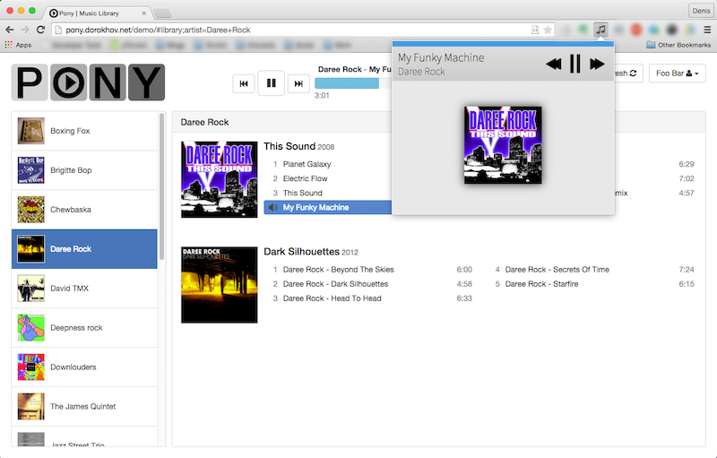
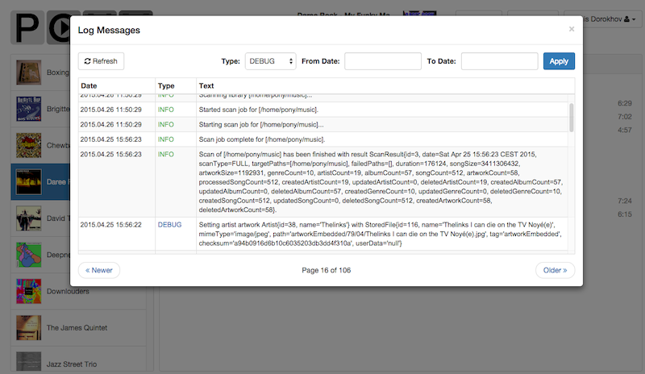
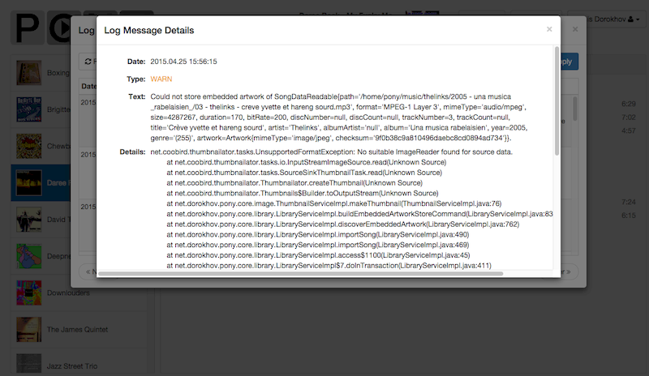

Pony - Music Streamer
=====================

<b>Pony</b> is an open source music streaming server written in Java.

This project was originally started as a playground for development of my skills in Java and modern web interfaces. Later it turned into something that I really like to use myself. If you have an MP3 collection that you want to listen in your web browser, then probably it's a project for you. This is the second version of Pony Music Streamer and I've finally decided to finish it as a ready-to-use application. I hope somebody else finds it useful ;-)

<b>Status:</b> version 0.1 is currently being tested.

## Features

* Optimized for large music collections (tested on hundreds of gigabytes).
* Easy-to-use web GUI.
* MP3 audio library based on contents of ID3 tags.
* Display of music artworks - both MP3-embedded and file based.
* HTML5 audio player.
* Multi-user system with separation of roles.
* Installation GUI.
* Multimedia keys support in Google Chrome browser with the help of [Media Keys by Sway.fm](https://chrome.google.com/webstore/detail/icckhjgjjompfgoiidainoapgjepncej) extension.
* RESTful API.

## Screenshots

Library view with playing audio:

Integration with "Media Keys by Sway.fm" Chrome extension:

Library folders configuration with automatic scan scheduling:

Scan log and progress indicator:

Email and password based authentication:

List of users:

User edit:

System log:

Log message details to see what exactly went wrong:

Installation:

## Demo

Online demo can be tested here: [http://pony.dorokhov.net/demo](http://pony.dorokhov.net/demo)

Please authenticate with **"foo@bar.com"** as email and **"demo"** as password.

## Installation

Pony is still in development and if you want to install Pony there is no other way than build it. Ready-to-run distribution is still TODO.

1. Clone the repository.
2. Run Maven build on "server/pony.server" project.
3. Get the WAR file from "server/pony.web/target" and deploy it into Tomcat or Jetty application server.
4. Open your deployed application, fill the installation form and install Pony.
5. Wait until your library is scanned.
6. Enjoy your online MP3 collection :-)

## Known Issues

* Currently only MP3 audio is supported.
* Needs more testing in different browsers. I test mostly in Google Chrome.
* Needs more testing on Windows. I test mostly on Mac OS X and Linux.
* Current web GUI is targeted at the latest versions of desktop browsers (Chrome, Firefox, Safari, Internet Explorer 11). Other browsers (including mobile ones) are currently not supported.

## Technologies

* Spring MVC
* RESTful JSON API
* Spring Data JPA
* JPA / Hibernate / H2
* Hibernate Search / Lucene
* Spring Security
* Token-based authentication system.
* JSR 303 Bean Validation (Hibernate Validator)
* Google Web Toolkit
* [GWT-Platform](https://github.com/ArcBees/GWTP)
* [RestyGWT](https://github.com/resty-gwt/resty-gwt)
* [GwtBootstrap3](https://github.com/gwtbootstrap3/gwtbootstrap3)
* Maven

## Development Roadmap

* Library statistics GUI (number of songs, total file size, etc.)
* Edit current user GUI.
* Export artist / album / song GUI.
* Search GUI.
* Edit audio tags GUI.
* Playback mode GUI: shuffle, repeat, repeat all, etc.
* Ready-to-run distrubution.
* REST API documentation.
* More tests.
* iOS application.
* Android application.
